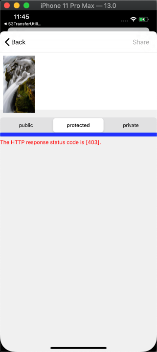
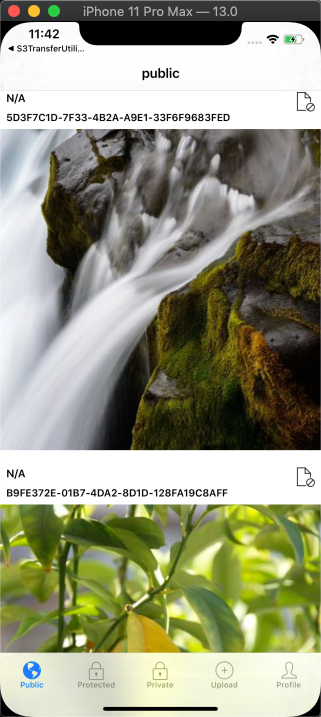
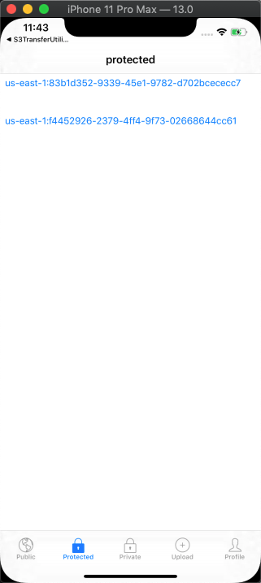
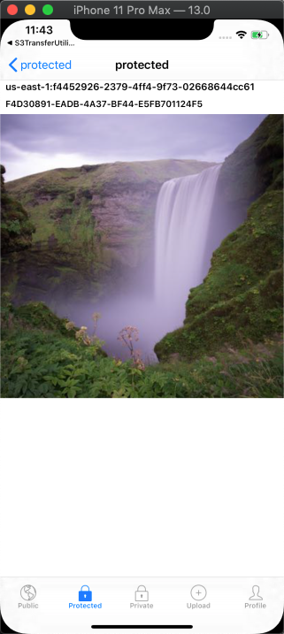
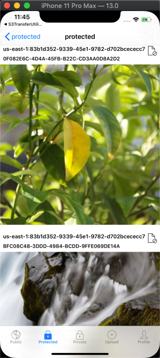
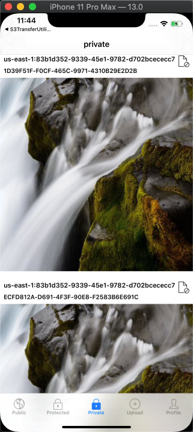

## Amplify Storage Sample App

This sample app showcases Amplify Storage access levels (guest, protected, private).

#### Provision backend resources

1. Run `amplify init` and choose `ios` for the type of app you're building

3. Add storage `amplify add storage`. 
    * choose `Content (Images, audio, video, etc.)`
    * You need to add auth (Amazon Cognito) to your project in order to add storage for user files. Do you want to add auth now? `Yes`
    * How do you want users to be able to sign in? `Username`
    * Do you want to configure advanced settings? `No, I am done.`
    * Who should have access: `Auth and guest users`
    * What kind of access do you want Authenticated users? Select `create/update`, `read`, and `delete`
    * What kind of access do you want Guest users? Select `create/update`, `read`, and `delete`
    * Do you want to add a Lambda Trigger for your S3 Bucket? `No`

4. Provision the backend with `amplify push`

#### Update local pod directories

Go to the Podfile and update the path to your locally cloned [amplify-ios](https://github.com/aws-amplify/amplify-ios) repo.

#### Install dependencies

If you are trying to install the latest changes from your local pod, make sure to run `pod cache clean --all` to clear the pods for a fresh install, otherwise, run

```bash
pod install
```

Then open the workspace

```bash
open AmplifyStorageSampleApp.xcworkspace
```

Build and Run (`CMD+R`) the App. If you encounter any issues, you can try to clean all (`CMD+shift+k`) and rebuild.

## Demo

A user that is signed in can choose to upload an image with guest/protected/private access. 

A user that isn't signed in will get AccessDenied when trying to upload to protected or private.



Files uploaded with guest access level can be viewed and deleted by everyone.



Files uploaded with protected access level can be viewed by everyone.




Only users can delete their own files that were uploaded to protected/private.



Only users can view the files uploaded to private.




